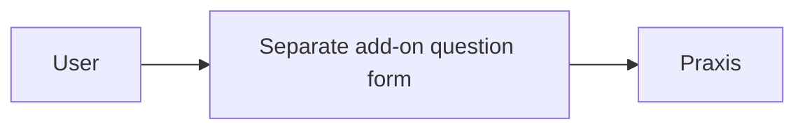
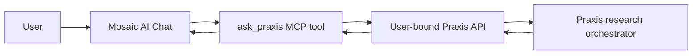

# Praxis Legal MCP for Mosaic

Add Praxis as an MCP server. Ask your Mosaic agent to use `ask_praxis`; Praxis runs its research orchestrator and returns the answer to Mosaic chat.

## Before / After

**Before**


**After**


This integration has no embedded website, separate question form, or Custom Endpoint agent setup. The catalog tab only checks whether the MCP server is connected and exposes `ask_praxis`. It requests only `mcp:read`.

## Connect the MCP server

The catalog tarball contains the manifest and renderer. It does **not** install the MCP server. Get this repository's source and install the server separately:

```sh
cd addons/praxis-legal/mcp
npm ci
```

Create a Mosaic key in your Praxis instance at `/dashboard/mosaic`. Save it in 1Password. With the 1Password CLI available and authorized, register the server:

```sh
PRAXIS_BASE_URL=https://your-praxis-instance.example \
PRAXIS_MOSAIC_TOKEN_REF=op://your-vault/your-item/your-field \
node setup.mjs
```

The setup stores the origin and secret reference in Mosaic's MCP configuration. The server resolves the key using `op read` when called. Refresh **MCP Servers** and connect `praxis-legal`. It should expose `ask_praxis`.

You can also add it manually in Mosaic: transport **stdio**, command your Node executable, args the absolute path to `mcp/server.mjs`, and the two environment values shown above. Use Node 20 or later.

## Ask in Mosaic

Open **AI Chat** with a configured Mosaic agent that can use MCP tools. For example:

> Use ask_praxis to answer: What is the Rule 56 summary judgment standard?

Mosaic calls the tool, which calls the user-bound Praxis API and returns the orchestrator's answer. Explicitly asking for the tool makes the intended route clear. An ordinary question without that instruction depends on the agent choosing the tool.

The current key permits public-law research only. It does not grant firm-document or matter access. Do not include client or matter facts. Praxis keys expire after 30 days and can be revoked at `/dashboard/mosaic`. Mosaic retains chat history locally.

## Checks and publication

```sh
node --test addons/praxis-legal/test/*.test.mjs addons/praxis-legal/mcp/protocol.test.mjs
node scripts/build-addon.mjs praxis-legal
```

The MCP protocol test checks initialization, tool discovery, and an `ask_praxis` call through a mock user-bound API. The status tests cover connected, disconnected, missing-tool, and failed-connection states.

Earlier desktop testing proved Mosaic chat invoking the MCP tool with a deterministic test model. A live user-bound production answer was separately verified through the MCP tool. A production model's independent tool selection is not yet proven. These are local proofs; catalog publication and a fresh catalog-install test remain pending upstream review.
